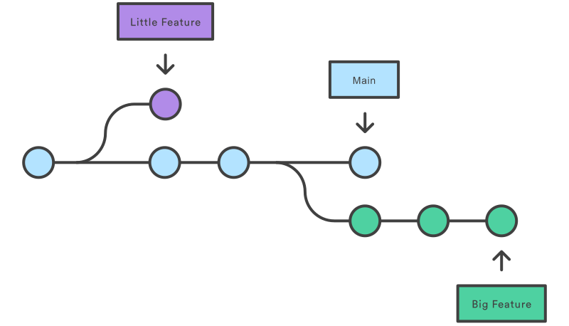
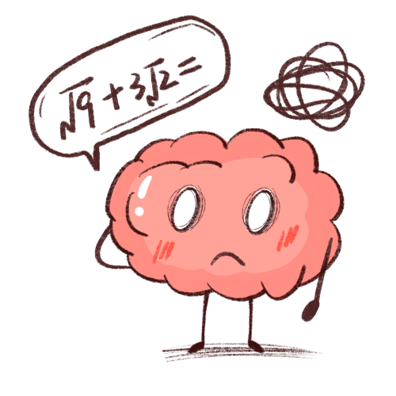

# Taller Git y GitHub

## GitHub

¿Qué es y para que sirve GitHub?

## GIT
 es un software de control de versiones.

### ¿Qué es el control de versiones?
Se llama control de versiones a la gestión de los diversos cambios que se realizan sobre los elementos de algún producto o una configuración del mismo. Una versión, revisión o edición de un producto, es el estado en el que se encuentra el mismo en un momento dado de su desarrollo o modificación.

Los sistemas de control de versiones son software que ayudan a realizar un seguimiento de los cambios realizados en el código a lo largo del tiempo. A medida que un desarrollador edita el código, el sistema de control de versiones toma una instantánea de los archivos.

[INSTALACIÓN](https://git-scm.com/download/win)

## Ramas 
Las ramas en git son una división del estado del código, esto permite crear nuevos caminos a favor de la evolución del código. Una rama representa una línea independiente de desarrollo. Las nuevas confirmaciones se registran en el historial de la rama actual, lo que crea una bifurcación en el historial del proyecto.

 

## Commandos

## Clone
Git clone es un comando para descargarte el código fuente existente desde un repositorio remoto (como Github, por ejemplo).

```

git clone path_repositorio

```

## Status
El comando de git status nos da toda la información necesaria sobre la rama actual. Podemos encontrar información como:

Si la rama actual está actualizada
Si hay algo para confirmar, enviar o recibir.
Si hay archivos en preparación , sin preparación o que no están recibiendo seguimiento.
Si hay archivos creados, modificados o eliminados.

```

git status

```

### Add
Cuando creamos, modificamos o eliminamos un archivo, estos cambios suceden en local y no se incluirán en el siguiente commit (a menos que cambiemos la configuración).

Necesitamos usar el comando git add para incluir los cambios del o de los archivos en tu siguiente commit.
```

git add <archivo>

git add . //Añadir los cambios del directorio actual

git add A //Añadir todo de una vez

```

NOTA: El comando git add no cambia el repositorio y los cambios que no han sido guardados hasta que no utilicemos el comando de confirmación git commit.

### Commit
Es una confirmación de cambios (commit). Git almacena una instantánea de tu trabajo preparado. Dicha instantánea contiene además unos metadatos con el autor y el mensaje explicativo.
Git commit es como establecer un punto de control en el proceso de desarrollo al cual puedes volver más tarde si es necesario.

También necesitamos escribir un mensaje corto para explicar qué hemos desarrollado o modificado en el código fuente.

```

git commit -m "mensaje de confirmación"

```

NOTA: Git commit guarda tus cambios únicamente en local.

### Push
Después de haber confirmado tus cambios, el siguiente paso que quieres dar es enviar tus cambios al servidor remoto. Git push envía tus commits al repositorio remoto.

```

git push

git push -u origin <nombre-de-tu-rama> //si tu rama ha sido creada recientemente y no está en el repositorio remoto, puede que tengas que cargar y subir tu rama con este comando

```

### Pull
Se utiliza para recibir actualizaciones del repositorio remoto. Este comando es una combinación del git fetch y del git merge lo cual significa que cundo usemos el git pull recogeremos actualizaciones del repositorio remoto (git fetch) e inmediatamente aplicamos estos últimos cambios en local (git merge).

```

git pull

git pull origin <nombre-de-tu-rama>

```

### Fetch
Este comando descarga el contenido del repositorio remoto sin modificar el estado del repositorio local. Es el comando que le dice a tu git local que recupere la última información de los metadatos del original pero no hace ninguna transferencia de archivos.

Más bien es como **comprobar** si hay algún cambio disponible.

```

 git fetch

```

### Merge
Una vez se ha terminado de desarrollar la funcionalidad de una rama y todo funcione correctamente, se debe fusionar la rama con la rama padre (main, develop, back...)

El merge, como su nombre indica, mezcla todas las modificaciones de tu rama con las modificaciones realizadas en la rama padre. 

### Ejemplo
```
// Queremos fusionar la rama back con la rama develop. 

1. Para fusionar la rama back con la develop, lo primero será asegurarnos de que estamos en la rama develop (la rama con la que se quiere fusionar). Si no es así habrá que cambiarse a la rama:
    *git checkout develop*
    
2. Actualizar la rama develop local para ver si hay conflictos antes del fusionado:
    *git fetch*
    
3. Fusionar con la rama back
    *git merge back* 
```
NOTA: Asegúrate de que tu rama develop está actualizada (última versión) antes de fusionar otras ramas, si no aparecerán algunos conflictos no deseados. 



### Diff
Este comando sirve para ver las diferencias el punto de partida de datos y las modificaciones realizadas.

```
git diff <nombre-fichero>

```

### Revert
Revert se usa deshacer cambios ya confirmados (commiteados).

Antes que nada, necesitaríamos ver nuestro historial de commits para conocer el código del commit que queremos revertir, y para ello necesitamos utilizar el  siguiente comando:

```

git log
git log -- oneline //menos detallado

```

NOTA: para salir del log, presionar la letra q. 

Luego debemos ejecutar el siguiente comando para especificar el código que encontrarás junto al commit que queremos deshacer:

```

git revert <codigo>

```
NOTA: El comando git revert deshará el commit que le hemos indicado, pero creará un nuevo commit deshaciendo la anterior.

## Ejercicios
1. Crea un repositorio en GitHub (repositorio remoto). 
2. Clona el repositorio en local. 
3. Crea un archivo.txt en tu repositorio local.
4. Sube el archivo al repositorio remoto. 
5. Modifica el archivo.txt en local y mira que le pasa al archivo en el repositorio remoto.
6. Busca el comando para crear un nueva rama y crea una nueva rama en tu repositorio local.
7. Busca el comando para borrar una rama, crea una nueva rama y bórrala.
8. Busca el comando para cambiar de una rama a otra, crea dos ramas y cambiate de una a otra. 
9. Busca el comando para crear una rama y cambiarte al mismo tiempo, crea una rama y prueba el comando. 
10. Ejercicio en grupos de dos/tres:
    - Un miembro del grupo crea el repositorio remoto.
    - Todos los miembros del grupo clonan dicho repositorio (El dueño del repositorio, el que lo creó, deberá pasarles la url del repositorio)
    - Un miembro del grupo crea un fichero en local y lo sube (push) al repositorio. 
    - Los demás compañeros deberán descargarse el fichero (pull).
    - Todo los miembros del grupo modifican el mismo fichero en local. 
    ¿Qué ocurre?
