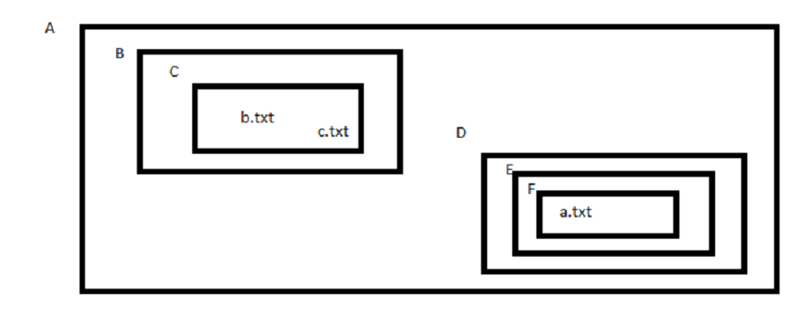

# Rutas
En informática, una ruta (path, en inglés) es la forma de referenciar un archivo informático o directorio en un sistema de archivos de un sistema operativo determinado.

Una ruta señala la localización exacta de un archivo o directorio mediante una cadena de caracteres concreta. Esta puede ser de diversas formas dependiendo del sistema operativo y del sistema de archivos en cuestión. En líneas generales se compondrá de los nombres de los directorios que conforman el camino hasta el archivo o directorio a lo largo del árbol de directorios, y finalmente estará el nombre del archivo o directorio que se quiere referenciar. Estos nombres estarán separados por un carácter delimitador que usualmente será la barra invertida (\\) en sistemas operativos MS-DOS y Windows (de Microsoft) o la barra (/) en sistemas UNIX o Linux.

## Ruta absoluta
Ruta completa desde la raíz del árbol de directorios **C:\\** usualmente en Windows o **/** en UNIX o Linux.

Ejemplos de rutas absolutas: 

```
    D:\ini_php_laravel\teoria
    
    /home/willy/notas 
    
    /usr/bin

```

## Ruta relativa

Una ruta relativa es aquella que marca el camino respecto al directorio en el que nos encontramos. Pare ello disponemos de dos herramientas:

1. . -> Referencia al directorio actual
2. .. -> Referencia al directorio anterior o contenedor

```
    ../proyecto/ejercicio-web-personal.md
   
    ./foto.png
    
```

### Ejercicio

La mejor manera de ver esto es con ejercicios. Partiendo del diagrama de directorios y ficheros siguiente: 



1. Estando en B acceder a b.txt usando ruta relativa
2. Estando en C acceder a F usando ruta absoluta
3. Estando en F acceder a A usando ruta relativa
4. Estando en D acceder a c.txt usando ruta absoluta
5. Estando en C acceder a a.txt usando ruta abosulta
6. Estando en C acceder a a.txt usando ruta relativa
7. Estando en E acceder a E usando ruta absoluta
8. Estando en E acceder a E usando ruta relativa
9. Estando en E acceder a D usando ruta relativa
10. Estando en E acceder a F usando ruta relativa
11. Estando en E acceder a F usando ruta absoluta

[SOLUCIÓN](./sol_ejer_rutas.md)
