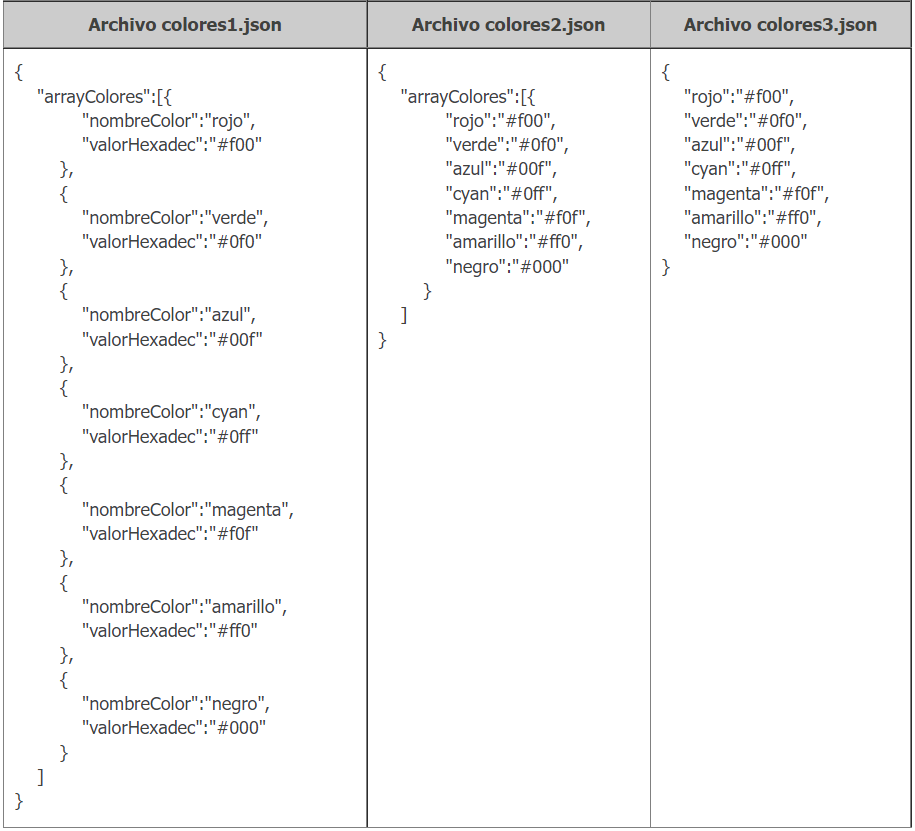
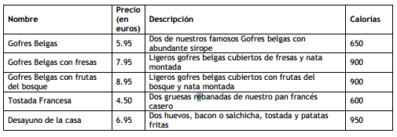

# JSON 
Los JSON son cadenas de caracteres útiles cuando se quiere transmitir datos y se han convertido en un estándar muy usado en desarrollo web. 

JSON es un subconjunto del lenguaje JavaScript, así que comparte algunas construcciones del lenguaje. En ellos guardamos combinaciones desordenadas de keys y values en objetos.

Veamos ejemplos de JSON: 




Los **datatypes** que soporta JSON son: **strings**, **números**, **booleanos** y **null**, además de soportar objetos y arrays como valores. 

NOTA: no se pueden transmitir tipos como fechas de forma nativa (se puede, pero es necesario transformarlos en un string o en un unix timestamp como un integer).

## Arrays como JSON
Ya podemos intuir por los ejemplos que podemos combinar las {} (diccionarios o conjuntos clave-valor) y los [] dentro de los JSON como queramos. 

Veamos un ejemplo, algo más complejo: 

```Javascript 

    [
    {
      "nombre": "Francisco Ramirez",
      "edad": 29,
      "puesto": "Contable",
      "Emails": [
        "francisco@gmail.com",
        "francisco@hotmail.es",
        "francisco@thebridgeschool.es"
      ]
    },
    {
        "nombre": "Isabel Pérez",
        "edad": 31,
        "puesto": "Profesora",
        "Emails": [
          "isabel@gmail.com",
          "isabel@hotmail.es",
          "isabel@thebridgeschool.es"
        ]
      }
  ]

```
[MÁS_INFO_JSON](https://developer.mozilla.org/es/docs/Web/JavaScript/Reference/Global_Objects/JSON)


## Codificación en PHP

Con **json_encode** se puede traducir objetos, tipos de datos de PHP a un string JSON.

```php
class Persona {
    public $nombre = "";
    public $apellido = "";
    public $fechaNacimiento = "";
}
$usuario = new Persona();
$usuario->nombre = "Brat";
$usuario->apellido = "Pit";
json_encode($usuario);
// Devuelve: {"nombre": "Brat", "apellido": "Pit"}
$usuario->fechaNacimiento = new DateTime();
json_encode($usuario);
var_dump($usuario);

$people_info = [
    "customers" => [
        ["name" => "Andrew", "score" => 62.5],
        ["name" => "Adam", "score" => 65.0],
        ["name" => "Sajal", "score" => 72.2],
        ["name" => "Monty", "score" => 57.8]
    ]
];
echo json_encode($people_info);

```

## Decodificación en PHP
Es lo contrario a codificar: de string JSON a objetos, tipos de datos...

Acepta cuatro parámetros, pero en la mayoría de las situaciones solamente necesitaremos los dos primeros. El primer parámetro especifica la cadena que quieras decodificar. El segundo parámetro determina de qué manera se devuelven los datos decodificados. Establecer su valor en **true** devolverá una matriz asociativa, mientras que **false** devolverá objetos (clase stdClass). 

NOTA: ¿Qué es stdClass? Es una clase predefinida en php, que no tiene ningún atributo ni métodos. Y la podemos usar cuando queremos crear un objeto genérico al que después podemos agregar propiedades.

```php

$string = '{"nombre": "Leonardo", "apellido": "DiCaprio"}';
$resultadoF = json_decode($string,false);
$resultadoT = json_decode($string,true);
var_dump($resultadoF);
echo '<br>';
var_dump($resultadoT);


```
 ### Lectura de JSON desde un archivo

 ```
 //Fichero JSON
 {
    "name": "María",
    "email": "maria@something.com",
    "age": 27,
    "countries": [
        {"name": "Spain", "year": 1982},
        {"name": "Australia", "year": 1996},
        {"name": "Germany", "year": 1987}
    ]
}
 ```

 ```php

$people_json = file_get_contents('people.json');
$decoded_json = json_decode($people_json, false);
echo $decoded_json->name;
echo $decoded_json->email;
echo $decoded_json->age;

$people_json = file_get_contents('people.json');
$decoded_json = json_decode($people_json, true);
echo $decoded_json['name'];
echo $decoded_json['email'];
echo $decoded_json['age'];

$people_json = file_get_contents('people.json');
$decoded_json = json_decode($people_json, true);
$name = $decoded_json['name'];
$countries = $decoded_json['countries'];
foreach($countries as $country) {
    echo $name.' visited '.$country['name'].' in '.$country['year'].'.';
}

 ```

## Ejercicios 

1. Partiendo del siguiente JSON

```Javascript 
    {
        "localidad_1": {
        "Continente": "África",
        "País": "Angola",
        "Capital": "Luanda"
        },
        "localidad_2": {
        "Continente": "América del Norte",
        "País": "Estados Unidos",
        "Capital": "Washington DC"
        },
        "localidad_3": {
        "Continente": "América Central",
        "País": "México",
        "Capital": "Ciudad de México"
        },
        "localidad_4": {
        "Continente": "América del sur",
        "País": "Brasil",
        "Capital": "Brasilia"
        },
        "localidad_5": {
        "Continente": "Europa",
        "País": "España",
        "Capital": "Madrid"
        },
        "localidad_6": {
        "Continente": "Europa",
        "País": "Alemania",
        "Capital": "Berlín"
        },
        "localidad_7": {
        "Continente": "Oceanía",
        "País": "Australia",
        "Capital": "Camberra"
        },
        "localidad_8": {
        "Continente": "Asia",
        "País": "Japón",
        "Capital": "Tokio"
        }
    }

```

Siendo a la variable que almacena el JSON
- Código para obtener el país de la localidad_8
- Código que permite añadir una localidad a tu elección
- Modifica la localidad 4, añadiendo el número de habitantes
- Cambia la estructura del JSON de forma que sea más directo acceder a las capitales de las localidades, dado que va a ser el dato que más vamos a consultar

3. A partir de la siguiente información, diseña y elabora un JSON que la contenga y permita acceder de manera lo más sencilla posible, a precio y calorías de cada desayuno.


