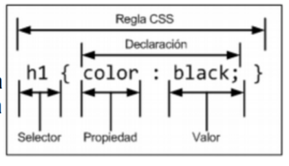

# Introducción CSS3


CSS es un lenguaje de hojas de estilos creado para controlar el aspecto o presentación de los
documentos HTML. CSS es la mejor forma de separar los contenidos y su presentación y es imprescindible para crear páginas web complejas.

Al crear una página web, se utiliza en primer lugar el lenguaje HTML para marcar los contenidos, es decir, para designar la función de cada elemento dentro de la página: párrafo, titular, texto destacado, tabla, lista de elementos, etc. Una vez creados los contenidos, se utiliza el lenguaje CSS para definir el aspecto de cada elemento: color, tamaño y tipo de letra del texto, separación horizontal y vertical entre elementos, posición de cada elemento dentro de la página, etc.

## Ejemplo
```
    <!DOCTYPE html>
    <html lang="es">
    <head> 
        <meta charset="UTF-8" />
        <title>Primer Ejemplo CSS</title>
        <style type="text/css">
            h1 { color: red; font-family: Arial; font-size: large; }
            p { color: gray; font-family: Verdana; font-size: medium; }
        </style>
    </head>
    <body>
        <section>
            <h1>Titular de la página</h1>
            <p>Un párrafo de texto no muy largo.</p>
        </section>
    </body>
    </html>

```

## Formas de incluir CSS en HTML

### Dentro de las etiquetas HTML 
```

    <!DOCTYPE html>
    <html>

        <head>
            <meta http-equiv="Content-Type" content="text/html; charset=iso-8859-1" />
            <title>Ejemplo de estilos CSS dentro de las etiquetas</title>
        </head>

        <body>
            <p style="color: red; font-family: Verdana;">Un párrafo de texto.</p>
        </body>

    </html>

```

### Dentro del mismo archivo HTML 
 ```

    <!DOCTYPE html>
    <html lang="es">

    <head>
        <meta charset="UTF-8" />
        <title>Ejemplo de estilos dentro del mismo archivo HTML</title>
        <style type="text/css">
            h1 {
                color: red;
                font-family: Arial;
                font-size: large;
            }

            p {
                color: gray;
                font-family: Verdana;
                font-size: medium;
            }
        </style>
    </head>

    <body>
        <section>
            <h1>Titular de la página</h1>
            <p>Un párrafo de texto no muy largo.</p>
        </section>
    </body>

    </html>

```

### En un fichero externo 
En este caso, todos los estilos CSS se incluyen en un archivo de tipo CSS que las páginas HTML
enlazan mediante la etiqueta <link>. Un archivo de tipo CSS no es más que un archivo simple de
texto cuya extensión es .css Se pueden crear todos los archivos CSS que sean necesarios y cada
página HTML puede enlazar tantos archivos CSS como necesite.

Si se quieren incluir los estilos del ejemplo anterior en un archivo CSS externo, se deben seguir los
siguientes pasos:
1. Se crea un archivo de texto (en la carpeta css dentro de ejemplosCSS) llamado estilos.cssy se le añade solamente el siguiente contenido: 

    p { color: blue; font-family: Verdana; }

3. Se guarda el archivo de texto con el nombre estilos.css
4. En la página HTML se enlaza el archivo CSS externo mediante la etiqueta **link**

```

    <!DOCTYPE html>
    <html lang="es">

    <head>
        <meta charset="UTF-8" />
        <title>Ejemplo de estilos desde fichero externo</title>
        <link rel="stylesheet" type="text/css" href="estilos.css"/>
    </head>

    <body>
        <section>
            <p>Un párrafo de texto.</p>
        </section>
    </body>

</html>

```

## Reglas CSS
CSS define una serie de términos que permiten describir cada una de las partes que componen los estilos CSS. El siguiente esquema muestra las partes que forman un estilo CSS muy básico:



Los diferentes términos se definen a continuación:
- **Regla:** cada uno de los estilos que componen una hoja de estilos CSS. Cada regla está compuesta de una parte de "selectores", un símbolo de "llave de apertura" ({), otra parte denominada declaración" y por último, un símbolo de "llave de cierre" (}).

- **Selector:** indica el elemento o elementos HTML a los que se aplica la regla CSS.

- **Declaración:** especifica los estilos que se aplican a los elementos. Está compuesta por una o más propiedades CSS.

- **Propiedad:** característica que se modifica en el elemento seleccionado, como por ejemplo su tamaño de letra, su color de fondo, etc.

**Valor:** establece el nuevo valor de la característica modificada en el elemento.

Un archivo CSS puede contener un número ilimitado de reglas CSS, cada regla se puede aplicar a varios selectores diferentes y cada declaración puede incluir tantos pares propiedad/valor como se desee. 

## Comentarios

```

    /* Este es un comentario en CSS */

    /* Este es un
    comentario CSS de varias
    lineas */


```

## Selectores
Permiten localizar los elementos HTML sobre los que queremos aplicar las reglas CSS.

## Selectores Básicos
### Universal
Se utiliza para seleccionar todos los elementos de la página. El siguiente ejemplo elimina el margen y el relleno de todos los elementos HTML (por ahora no es importante fijarse en la parte de la declaración de la regla CSS):

```
    * {
    margin: 0;
    padding: 0;
    }

```

El selector universal se indica mediante un asterisco (*). A pesar de su sencillez, no se utiliza habitualmente, ya que es difícil que un mismo estilo se pueda aplicar a todos los elementos de una página. 

No obstante, sí que se suele combinar con otros selectores.

### Selector de etiqueta 
Selecciona todos los elementos de la página cuya etiqueta HTML coincide con el valor del selector. El siguiente ejemplo selecciona todos los párrafos de la página:

```

    p {
    ...
    }

```
Para utilizar este selector, solamente es necesario indicar el nombre de una etiqueta HTML (sin los
caracteres < y >) correspondiente a los elementos que se quieren seleccionar. El siguiente ejemplo aplica diferentes estilos a los titulares y a los párrafos de una página HTML:

```

    h1 {
    color: red;
    }
    h2 {
    color: blue;
    }
    p {
    color: black;
    }

```
Si se quiere aplicar los mismos estilos a dos etiquetas diferentes, se pueden encadenar los selectores. En el siguiente ejemplo, los títulos de sección h1, h2 y h3 comparten los mismos estilos:

``` 

    h1 {
        color: #8A8E27;
        font-weight: normal;
        font-family: Arial, Helvetica, sans-serif;
    }
    h2 {
        color: #8A8E27;
        font-weight: normal;
        font-family: Arial, Helvetica, sans-serif;
    }
    h3 {
        color: #8A8E27;
        font-weight: normal;
        font-family: Arial, Helvetica, sans-serif;
    }

```
En este caso, CSS permite agrupar todas las reglas individuales en una sola regla con un selector múltiple. Para ello, se incluyen todos los selectores separados por una coma (,) y el resultado es que la siguiente regla CSS es equivalente a las tres reglas anteriores:

```

    h1, h2, h3 {
        color: #8A8E27;
        font-weight: normal;
        font-family: Arial, Helvetica, sans-serif;
    }

```

En las hojas de estilo complejas, es habitual agrupar las propiedades comunes de varios
elementos en una única regla CSS y posteriormente definir las propiedades específicas de esos
mismos elementos. El siguiente ejemplo establece en primer lugar las propiedades comunes de
los títulos de sección (color y tipo de letra) y a continuación, establece el tamaño de letra de cada
uno de ellos.

Ejemplo: 

```
    <!DOCTYPE html>
    <html lang="es">
        <head> <meta charset="UTF-8" />
            <title>Ejemplo de estilos sin CSS</title>
            <style type="text/css">
                h1, h2, h3 {
                    font-weight: bold;
                    font-family: Arial, Helvetica, sans-serif;
                }
                h1 { color: blue; }
                h2 { color: #F00; }
                h3 { color: rgb(0,255,0); }
            </style>
        </head>
        <body>
            <section>
                <h1> Título Principal</h1>
                <h2> Apartado 1</h2>
                <h3> Sección A</h3>
                <p>Párrafo de ejemplo.</p>
             </section>
        </body>
    </html>

```
[LISTADO_PROPIEDADES](https://www.mclibre.org/consultar/amaya/css/css-propiedades.html)

### Ejemplo selector clase
```
    <!DOCTYPE html> 
    <html lang="es"> 
        <head> <meta charset="UTF-8" /> 
            <title>Ejemplo de estilos selector de clase</title> 
        <style type="text/css"> 
            .destacado { color: red; }
        </style> 
        </head> 
            <body> 
            <section> 
                <p class="destacado">Lorem ipsum dolor sit amet...</p>
                <p>Nunc sed lacus et est adipiscing accumsan...</p>
                <p>Class aptent taciti sociosqu ad litora...</p>
            </section> 
        </body>     
    </html>

```

### Ejemplo selector id

``` 
    <!DOCTYPE html> 
    <html lang="es"> 
        <head> <meta charset="UTF-8" /> 
            <title>Ejemplo de estilos selector de id</title> 
        <style type="text/css"> 
            #destacado { color: red; }
        </style> 
        </head> 
        <body> 
            <section> 
                <p>Primer párrafo</p>
                <p id="destacado">Segundo párrafo</p>
                <p>Tercer párrafo</p>
            </section> 
        </body> 
    </html>

```

### Descendente
Selecciona los elementos que se encuentran dentro de otros elementos. Un elemento es
descendiente de otro cuando se encuentra entre las etiquetas de apertura y de cierre del otro
elemento.

El selector del siguiente ejemplo selecciona todos los elementos **span** de la página que se
encuentren dentro de un elemento **p**:

```

    p span { 
        color: red; 
    }

```

Ejemplo: 

```

    <!DOCTYPE html> 
    <html lang="es"> 
        <head> <meta charset="UTF-8" /> 
            <title>Ejemplo de estilos selector descendente</title> 
            <style type="text/css"> 
                p span { color: red; } 
            </style> 
            </head> 
            <body> 
                <section> 
                    <p> Aquí tenemos parte del texto <span>en rojo</span>. 
                        <br /> 
                        Incluso en un nivel inferior, como un 
                        <a href="#"><span>enlace</span></a> 
                    </p> 
                    <br> 
                    Fuera del párrafo el <span> SPAN se mantiene negro</span> 
                </section> 
        </body> 
    </html>

```

Los selectores descendentes permiten aumentar la precisión del selector de tipo o etiqueta. Así,
utilizando el selector descendente es posible aplicar diferentes estilos a los elementos del mismo
tipo. El siguiente ejemplo amplía el anterior y muestra de color azul todo el texto de los **span**
contenidos dentro de un **h1**

Otro ejemplo: 

```

    <!DOCTYPE html> 
    <html lang="es"> 
        <head> <meta charset="UTF-8" /> 
            <title>Ejemplo de estilos seelctor descendente</title> 
            <style type="text/css"> 
                p span { color: red; }
                h1 span { color: blue; } 
            </style> 
        </head> 
    <body> 
        <section> 
            <h1> <span>Titulo en Azul</span></h1>
            <p> Aquí tenemos parte del texto <span>en rojo</span>. 
        </section> 
    </body> 
    </html>

```

Con las reglas CSS anteriores:

- Los elementos **span** dentro de un elemento **p** se muestran de color rojo.
- Los elementos **span** dentro de un elemento **h1** se muestran de color azul.
- El resto de elementos **span** de la página, se muestran con el color por defecto aplicado por el navegador.

[MÁS_RECURSOS](https://www.w3schools.com/css/)
