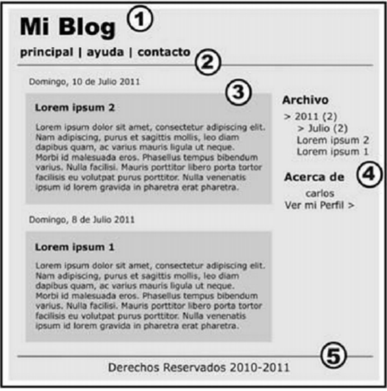

# Web Semántica con HTML5
La web semántica se incorporó con la versión 5 de HTML. La principal ventaja es que el contenido del sitio web estará correctamente estructurado. Además la información se reúne y procesa de manera que los buscadores puedan entender el significado de los documentos que encuentran e indexan



**body** del documento:

1.  Cabecera o **header**
2.  Barra de navegación o **nav**
3.  Sección de Información principal o **section**
4.  Barra Lateral o **aside**
5.  Pie de página o **footer**

Estos cinco componentes nos adentran en el marcado semántico, que emplea las etiquetas
siguientes:

```
    <header>, <nav>, <section>, <aside>, <footer>, <article>, <hgroup>, <figure> y <figcaption>

```

## Etiquetas 

### Header
Este elemento no debe ser confundido con **head**. Mientras este último se refiere al documento y
no se presenta, **header** muestras información introductoria al cuerpo del documento, como
títulos o logos. 

**Ejemplo:**
```
    <header>
        <h1>Este es el título principal del sitio web</h1>
    </header>

```
### Nav
Siguiendo con nuestro ejemplo, la siguiente sección es la Barra de Navegación. Esta barra es
generada en HTML5 con el elemento **nav**. 

**Ejemplo:**
```
    <!DOCTYPE html>
    <html lang="es">
        <head>
            <meta charset="UTF-8">
            <meta name="description" content="Ejemplo de HTML5">
            <meta name="keywords" content="HTML5, CSS3, JavaScript">
            <title>Este texto es el título del documento</title>
            <link rel="stylesheet" href="misestilos.css">
        </head>
        <body>
            <header>
                <h1>Este es el título principal del sitio web</h1>
            </header>
            <nav>
                <ul>
                    <li>principal</li>
                    <li>fotos</li>
                    <li>videos</li>
                    <li>contacto</li>
                </ul>
            </nav>
        </body>
    </html>

```

El elemento **nav** se encuentra dentro de las etiquetas **body** pero es ubicado después de la etiqueta de cierre de la cabecera **header**, no dentro de las etiquetas **header**. Esto es porque **nav** no es parte de la cabecera sino una nueva sección.


### Section
La columna Información Principal contiene la información más relevante del documento y puede
ser encontrada en diferentes formas (por ejemplo, dividida en varios bloques o columnas). Debido
a que el propósito de estas columnas es más general, el elemento en HTML5 que especifica estas
secciones se llama simplemente **section**.

Al igual que la Barra de Navegación, la columna Información Principal es una sección aparte. Por
este motivo, la sección para Información Principal va debajo de la etiqueta de cierre **nav**.
 
``` 
    <body>
    <nav>
    ....
    </nav>
    <section>
    ....
    </section>
    </body>
    </html>

```

### Aside
La Barra Lateral se ubica al lado de la columna Información Principal. Esta es una columna o
sección que normalmente contiene datos relacionados con la información principal pero que no
son relevantes o igual de importantes.

En el diseño de un blog, por ejemplo, la Barra Lateral contendrá una lista de enlaces. La
información dentro de esta barra está relacionada con la información principal pero no es relevante
por sí misma. En HTML5 podemos diferenciar esta información secundaria usando **aside**:

```
    <body>
    <section>
    ....
    </section>
    <aside>
        <blockquote>Mensaje número uno</blockquote>
        <blockquote>Mensaje número dos</blockquote>
    </aside>
    </body>
    </html>
```

[MÁS_INFORMACIÒN_BLOCKQUOTE](https://developer.mozilla.org/es/docs/Web/HTML/Element/blockquote)

El elemento **aside** podría estar ubicado del lado derecho o izquierdo de nuestra página de
ejemplo, la etiqueta no tiene una posición predefinida.


### Footer
Lo único que nos queda por hacer es cerrar nuestro diseño para otorgarle un final al cuerpo del
documento. Para ello usaremos **footer**. 

**Ejemplo:**
```
    ....
    <aside>
        <blockquote>Mensaje número uno</blockquote>
        <blockquote>Mensaje número dos</blockquote>
    </aside>
    <footer>
        Derechos Reservados &copy; 2010-2011
    </footer>

```

Generalmente, **footer** representará el final del cuerpo de nuestro documento. Sin embargo,
**footer** puede ser usado múltiples veces dentro del cuerpo para representar también el final de
diferentes secciones (del mismo modo que la etiqueta **header**). 


Ya hemos visto la estructura básica de un página web en HTML5, usando etiquetas semánticas.
De todos modos vamos a adentrarnos mas profundamente en la sección de Información principal,
que está dentro del elemento **section**.

### Article
Del mismo modo que los blogs están divididos en entradas, sitios web normalmente presentan
información relevante dividida en partes que comparten similares características. El elemento
**article** nos permite identificar cada una de estas partes.

```
    <!DOCTYPE html>
    <html lang="es">
        <head>
            ...
        </head>
        <body>
            ....
            <section>
            <article>
            Este es el texto de mi primer mensaje
            </article>
            <article>
            Este es el texto de mi segundo mensaje
            </article>
            </section>
            ....
        </body>
    </html>

```

Los artículos a su vez pueden tener **header** y **footer**: 

**Ejemplo:**
```
    <!DOCTYPE html>
    <html lang="es">
        <head>
            <meta charset="UTF-8">
            <meta name="description" content="Ejemplo de HTML5">
            <meta name="keywords" content="HTML5, CSS3, JavaScript">
            <title>Este texto es el título del documento</title>
            <link rel="stylesheet" href="misestilos.css">
        </head>
    <body>
        <header>
            <h1>Este es el título principal del sitio web</h1>
        </header>
        <nav>
            <ul>
                <li>principal</li>
                <li>fotos</li>
                <li>videos</li>
                <li>contacto</li>
             </ul>
        </nav>
        Curso de XHTML - HTML 4 / 5 Página 127
        <section>
            <article>
                <header>
                    <h1>Título del mensaje uno</h1>
                </header>
                Este es el texto de mi primer mensaje
                <footer>
                    <p>comentarios (0)</p>
                </footer>
            </article>
            <article>
                <header>
                    <h1>Titulo del mensaje dos</h1>
                </header>
                    Este es el texto de mi segundo mensaje
                <footer>
                    <p>comentarios (0)</p>
                </footer>
            </article>
        </section>
        <aside>
            <blockquote>Mensaje número uno</blockquote>
            <blockquote>Mensaje número dos</blockquote>
        </aside>
            <footer> Derechos Reservados &copy; 2010-2011 </footer>
        </body>
    </html>

```

### Hgroup
Este elemento sirve para agrupar cabeceras:

**Ejemplo:**
```
    ...
    <section>
        <article>
            <header>
                <hgroup>
                    <h1>Título del mensaje uno</h1>
                    <h2>Subtítulo del mensaje uno</h2>
                </hgroup>
                <p>publicado 10-12-2011</p>
            </header>
            Este es el texto de mi primer mensaje
            <footer>
                <p>comentarios (0)</p>
            </footer>
        </article>
        <article>
        Curso de XHTML - HTML 4 / 5 Página 128
        <header>
        <hgroup>
            <h1>Título del mensaje dos</h1>
            <h2>Subtítulo del mensaje dos</h2>
        </hgroup>
            <p>publicado 15-12-2011</p>
        </header>
        Este es el texto de mi segundo mensaje
        <footer>
            <p>comentarios (0)</p>
        </footer>
        </article>
    </section>
    ... 
```

Es importante reseñar que hgroup solo se usa cuando tenemos mas de un elemento **h** dentro
de la cabecera del artículo. Es decir, sólo se emplea para agrupar elementos **h**

El elemento **hgroup** fue creado con el propósito de agrupar las etiquetas H y evitar
interpretaciones incorrectas por parte de los navegadores.

### Figure y figcaption
La etiqueta **figure** fue creada para ayudarnos a ser aún más específicos a la hora de declarar el
contenido del documento. Antes de que este elemento sea introducido, no podíamos identificar el
contenido que era parte de la información pero a la vez independiente, como ilustraciones, fotos,
videos, etc... Normalmente estos elementos son parte del contenido relevante pero pueden ser
extraídos o movidos a otra parte sin afectar o interrumpir el flujo del documento. Cuando nos
encontramos con esta clase de información, las etiquetas **figure** pueden ser usadas para
identificarla:

```
    ...
    <article>
        <header>
        <hgroup>
            <h1>Título del mensaje uno</h1>
            <h2>Subtítulo del mensaje uno</h2>
        </hgroup>
            <p>publicado 09-01-2013</p>
        </header>
            Este es el texto de mi primer mensaje
        <figure>
            
            <figcaption>
                Esta es la imagen del primer mensaje
            </figcaption>
        </figure>
        <footer>
            <p>comentarios (0)</p>
        </footer>
    </article>
    ...

```
Esta es una práctica común, a menudo el texto es enriquecido con imágenes o videos. Las
etiquetas **figure** nos permiten envolver estos complementos visuales y diferenciarlos así de la
información más relevante.

Por otro lado, normalmente, unidades de información como imágenes o videos son descriptas con
un corto texto debajo. HTML5 provee un elemento para ubicar e identificar estos títulos
descriptivos. Las etiquetas **figcaption** encierran el texto relacionado con **figure** y establecen
una relación entre ambos elementos y su contenido.

