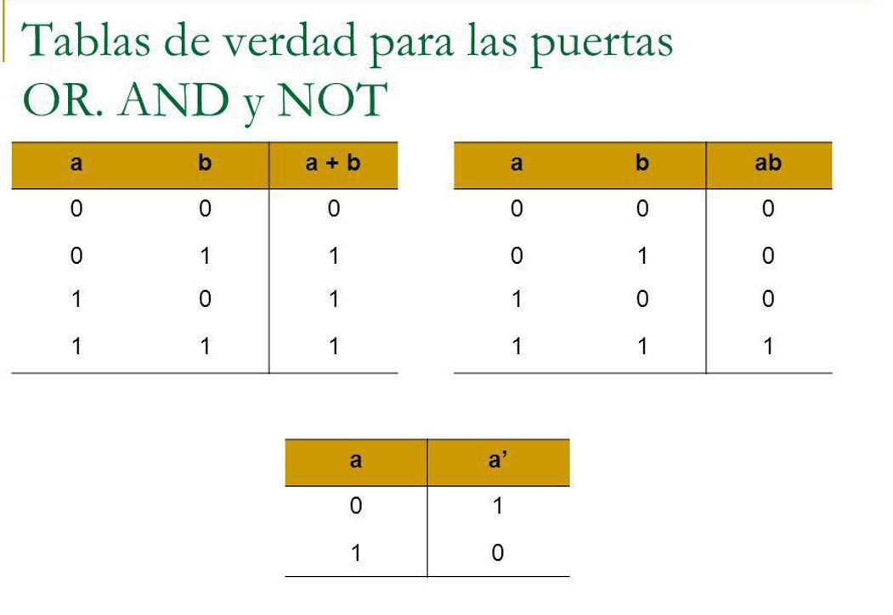

# Operadores
## Operadores básicos: 

### 1. Operaciones aritméticas básicas: 
Para poder realizar estas operaciones disponemos de los operadores básicos: 

```
    + -> Suma
```

```
    - -> Resta
```

```
    * -> Multiplicación 
```

```
    / -> División
```

```
    % -> Resto de la división entera
```


### Cuestión: ¿Cuál es el resultado de 143 % 140?

### 2. Asignación (=)
Este operador permite asignar valores a las variables o constantes. 

**Ejemplo:**
```javascript 

    var n = 7; //Asignación simple
    var n2 = n2 + n *3; //En esta caso se resuelve la expresión de la derecha y cuando hay un resultado se asigna a n2

```

### 3. Comparación 
En Javascript disponemos de cuatro maneras de realizar comparaciones (dos para igualdad y dos para desigualdad): 

#### == (igualdad)
El operador **==** nos permite comparar la igualdad de contenidos, pero sin forzar a ambos lados de la comparación la conversión de tipos. Se usa cuando sabemos que lo que estamos comparando pertenece al mismo tipo o cuando lo que quieras comparar sean contenidos, pero no sea relevante el tipo.

**Ejemplo:**
```javascript 

    var n = 9;
    var n2 = 9;
    console.log(n == n2); // Devuelve true porque son iguales los contenidos de las variables
    var n3 = 109;
    console.log(n == n3); // Devuelve false porque no son iguales los contenidos de las variables
    var n4 = '9';
    console.log(n == n4);// Devuelve true porque son iguales los contenidos de las variables aunque no los tipos
    var n5 = 9.0;
    console.log(n == n5);// Devuelve true porque son iguales los contenidos de las variables aunque no los tipos

```

#### === (igualdad estricta)
El operador **===** nos permite comparar la igualdad de contenidos, forzando a ambos lados de la comparación la conversión de tipos. Se usa cuando queremos confirmar los contenidos y los tipos

**Ejemplo:**
```javascript 
    var n = 9;
    var n2 = 9;
    console.log(n === n2); // Devuelve true porque son iguales los contenidos de las variables y los tipos
    var n3 = 109;
    console.log(n === n3); // Devuelve false porque no son iguales los contenidos de las variables
    var n4 = '9';
    console.log(n === n4);// Devuelve false porque son iguales los contenidos de las variables aunque no los tipos
    var n5 = 9.0;
    console.log(n === n5);// Devuelve true porque son iguales los contenidos de las variables y los tipos

```

#### != (desigualdad)
El operador **!=** nos permite comparar la desigualdad de contenidos, pero sin forzar a ambos lados de la comparación la conversión de tipos. Se usa cuando sabemos que lo que estamos comparando pertenece al mismo tipo o cuando lo que quieras comparar sean contenidos, pero no sea relevante el tipo.

**Ejemplo:**
```javascript 

    var n = 9;
    var n2 = 9;
    console.log(n != n2); // Devuelve false porque son iguales los contenidos de las variables
    var n3 = 109;
    console.log(n != n3); // Devuelve true porque no son iguales los contenidos de las variables
    var n4 = '9';
    console.log(n != n4);// Devuelve false porque son iguales los contenidos de las variables aunque no los tipos
    var n5 = 9.0;
    console.log(n != n5);// Devuelve false porque son iguales los contenidos de las variables aunque no los tipos

```

#### !== (desigualdad estricta)
El operador **!==** nos permite comparar la desigualdad de contenidos, forzando a ambos lados de la comparación la conversión de tipos. Se usa cuando queremos comprobar los cotenidos o los tipos, ya que da verdadero cuando los contenidos no son iguales o los tipos (o ambos)

**Ejemplo:**
```javascript 
    
    var n = 9;
    var n2 = 9;
    console.log(n !== n2); // Devuelve false porque son iguales los contenidos de las variables y los tipos
    var n3 = 109;
    console.log(n !== n3); // Devuelve true porque no son iguales los contenidos de las variables
    var n4 = '9';
    console.log(n !== n4);// Devuelve true porque no son iguales los tipos de las variables
    var n5 = 9.0;
    console.log(n !== n5);// Devuelve false porque son iguales los contenidos de las variables y los tipos
```

### Mayor y menor
Disponemos de operadores para comparar si un elemento es mayor o menor que otro: 

```
    > -> Mayor que
```

```
    < -> Menor que
```

```
    >= -> Mayor o igual que
```

```
    <= -> Menor o igual que
```

**Ejemplos:** 
```javascript 
    var a = 9;
    var b = 8;
    console.log(a>b); //Devuelve true porque a es mayor que b
    var c = 9;
    console.log(a>=c); //Devuelve true porque a es igual que c

    const cadena = "Hola";
    const cadena2 = "Adios";
    console.log(cadena > cadena2); //Devuleve true porque "Hola" es mayor alfabéticamente hablando
    console.log(cadena < cadena2);

```

### Operadores lógicos
Vamos a necesitar encadenar condiciones para hacerlas compuestas. 

Por ejemplo, podemos querer saber si un número es par y mayor que 5 (necesitaríamos usar un AND).

**NOT**

Se usa el operador **!** y se puede combinar con AND y OR

**Ejemplo:**
```javascript 

    var n = 9; 
    console.log(!(n==9)); //Devuelve false porque la comparación da true y lo negamos
    console.log(!false); //Devuelve true porque estamos negando false

```

**AND**

Se usa el operador **&&** y se puede combiar con NOT o con OR.

**Ejemplo:**
```javascript 

    var n = 9;
    console.log(n == 9 && n > 3); //Devuelve true porque las dos comparaciones dan true y el AND entre dos true es true
    console.log(n == 9 && n < 3); //Devuelve false porque n no es menor que 3

```
**OR** 

Se usa el operador **||** y se puede combiar con NOT o con AND.

**Ejemplo:**
```javascript 

    var n = 9;
    console.log(n == 9 || n > 3); //Devuelve true porque las dos comparaciones dan true y el OR entre dos true es true
    console.log(n == 9 || n < 3); //Devuelve true porque la primera comparación es true
    console.log(n == 7 || n < 3); //Devuelve false porque las dos son false y el OR entre dos false es
```

### Tablas de verdad AND, OR y NOT
Para entender los operadores lógicos veremos también las tablas de verdad:

Las tablas de verdad es una estrategia de la lógica que permite determinar las condiciones necesarias para que sea verdadero un enunciado propuesto. 



[MÁS_INFORMACIÓN_OPERADORES](https://developer.mozilla.org/es/docs/Web/JavaScript/Guide/Expressions_and_Operators)
