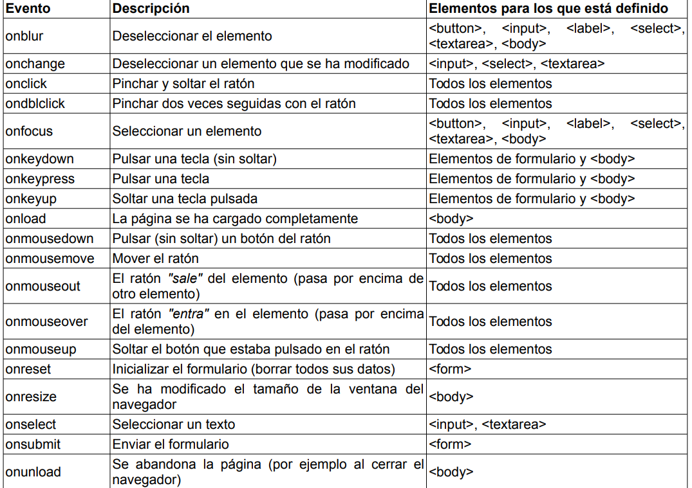

# Eventos Javascript

Los eventos hacen posible que los usuarios transmitan información a los programas. JavaScript
define numerosos eventos que permiten una interacción completa entre el usuario y las
páginas/aplicaciones web. La pulsación de una tecla constituye un evento, así como pinchar o mover
el ratón, seleccionar un elemento de un formulario, redimensionar la ventana del navegador, etc.

JavaScript permite asignar una función a cada uno de los eventos. De esta forma, cuando se produce
cualquier evento, JavaScript ejecuta su función asociada. Este tipo de funciones se denominan "event
handlers" en inglés y suelen traducirse por "manejadores de eventos"

El nombre de cada evento se construye mediante el prefijo on, seguido del nombre en inglés de la
acción asociada al evento. Así, el evento de pinchar un elemento con el ratón se denomina onclick y
el evento asociado a la acción de mover el ratón se denomina onmousemove.

La siguiente tabla resume los eventos más importantes definidos por JavaScript:



## Manejadores de eventos 
Un evento de JavaScript por sí mismo carece de utilidad. Para que los eventos resulten útiles, se
deben asociar funciones o código JavaScript a cada evento. De esta forma, cuando se produce un evento se ejecuta el código indicado, por lo que la aplicación puede responder ante cualquier evento que se produzca durante su ejecución.

Las funciones o código JavaScript que se definen para cada evento se denominan "manejador de eventos" y como JavaScript es un lenguaje muy flexible, existen varias formas diferentes de indicar los manejadores:

- Manejadores como atributos de los elementos HTML.
- Manejadores usando this
- Manejadores como funciones JavaScript externas.
- Manejadores "semánticos".

### Manejadores como atributos
Hemnos hecho todos nuestros ejercicios/ejemplos hasta ahora de esta forma, por lo que lo vemos con un ejemplo: 

```HTML

    <!DOCTYPE html>
    <html lang="es"> 
    <head> 
        <meta charset="UTF-8" /> 
        <title>Eventos</title> 
        <style type="text/css"> 
            div { 
                width: 300px; 
                height: 300px; 
                background: aquamarine; 
            } 
        </style> 
        <script language="JavaScript"> 
            function fuera() { 
                alert ("Has salido en la Caja!");
            } 
            function encima() { 
                alert (" Las características de la caja son: \n" + 
                " 300px de ancho y 300px de alto \n" + 
                " Color: Aguamarina"); 
            } 
        </script> 
    </head> 
    <body> 
        <div onmouseout="fuera();" onmouseover="encima();"></div> 
    </body> 
    </html>

```

También podemos hacer algo como esto: 

```HTML

    <body onload="alert('La página se ha cargado completamente');">
    ...
    </body>

```

El mensaje anterior se muestra después de que la página se haya cargado completamente, es decir, después de que se haya descargado su código HTML, sus imágenes y cualquier otro objeto incluido en la página.

El evento onload es uno de los más utilizados ya que, como se vio en el capítulo de DOM, las funciones que permiten acceder y manipular los nodos del árbol DOM solamente están disponibles
cuando la página se ha cargado completamente.

### Manejadores usando this
JavaScript define una variable especial llamada **this** que se crea automáticamente y que se emplea en algunas técnicas avanzadas de programación. En los eventos, se puede utilizar la variable this para referirse al elemento XHTML que ha provocado el evento. Esta variable es muy útil para ejemplos como el siguiente:

Cuando el usuario pasa el ratón por encima del **div**, el color del borde se muestra de color negro.
Cuando el ratón sale del **div**, se vuelve a mostrar el borde con el color gris claro original.
Elemento **div** original:

```HTML

    <div id="contenidos" style="width:150px; height:60px; border:thin solid silver">
    Sección de contenidos...
    </div>

```

Si no se utiliza la variable **this**, el código necesario para modificar el color de los bordes, sería el siguiente:

```HTML

    <div id="contenidos" style="width:150px; height:60px; border:thin solid silver"
    onmouseover="document.getElementById('contenidos').style.borderColor='black';"
    onmouseout="document.getElementById('contenidos').style.borderColor='silver';">
    Sección de contenidos...
    </div>

```
El código anterior es demasiado largo y demasiado propenso a cometer errores. Dentro del código de
un evento, JavaScript crea automáticamente la variable this, que hace referencia al elemento XHTML
que ha provocado el evento. Así, el ejemplo anterior se puede reescribir de la siguiente manera:

NOTA: No funciona si se intenta sacar el código en una función externa: 

```HTML

    <!DOCTYPE html>
    <html lang="es">

    <head>
        <meta charset="UTF-8" />
        <title>JavaScript</title>
        <style type="text/css">
            div {
                width: 300px;
                height: 150px;
                border: 5px solid blue;
            }
        </style>
    </head>

    <body>
        <div onmouseover="this.style.borderColor='red';" onmouseout="this.style.borderColor='blue';"></div>
    </body>

    </html>

```

El código anterior es mucho más compacto, más fácil de leer y de escribir y sigue funcionando
correctamente aunque se modifique el valor del atributo id del **div**.

### Manejadores como funciones externas
La definición de los manejadores de eventos en los atributos HTML es el método más sencillo pero menos aconsejable de tratar con los eventos en JavaScript. El principal inconveniente es que se  complica en exceso en cuanto se añaden algunas pocas instrucciones, por lo que solamente es  recomendable para los casos más sencillos.

Si se realizan aplicaciones complejas, como por ejemplo la validación de un formulario, es
aconsejable agrupar todo el código JavaScript en una función externa y llamar a esta función desde el
elemento HTML.

Ejemplo: 

```HTML

    <input type="button" value="Pinchame y verás" onclick="alert('Gracias por pinchar');" />

```

Utilizando funciones externas se puede transformar en:

```HTML

    function muestraMensaje() {
        alert('Gracias por pinchar');
    }
    <input type="button" value="Pinchame y verás" onclick="muestraMensaje()" />

```

De este modo también hemos estado trabajando, veamos un ejemplo combinado con **this**:
```HTML

    <!DOCTYPE html>
    <html lang="es"> 
    <head> 
        <meta charset="UTF-8" /> 
        <title>JavaScript</title> 
        <style type="text/css"> 
            div { width: 300px; height: 150px; 
            background: aquamarine; 
            border: 5px solid blue; 
            } 
            img { width: 300px; height: 150px; 
            display: inline; 
        } 
        </style> 
        <script type="text/javascript"> 
            function dentro(objeto) { 
                objeto.style.background = "yellow"; } 
            function fuera(objeto) { 
                objeto.style.background = "red"; } 
            function oculta(objeto) { 
                objeto.style.display = "none"; } 
        </script> 
    </head> 
    <body> 
        <div onmouseover="dentro(this);" onmouseout="fuera(this);"> 
        </div> 
        <br> 
         
    </body> 
    </html>

```

### Manejadores semánticos 
Los métodos que se han visto para añadir manejadores de eventos (como atributos HTML y como funciones externas) tienen un inconveniente: "ensucian" el código HTML de la página.

Afortunadamente, existe un método alternativo para definir los manejadores de eventos de JavaScript. Esta técnica es una evolución del método de las funciones externas, ya que se basa en utilizar las propiedades DOM de los elementos XHTML para asignar todas las funciones externas que actúan de manejadores de eventos. 

Así, el siguiente ejemplo:


```HTML

    <input id="pinchable" type="button" value="Pinchame y verás" onclick="alert('Gracias
    por pinchar');" />

```

Se puede transformar en: 

```HTML
    <!DOCTYPE html>
    <html lang="es">
    <head> 
        <meta charset="UTF-8" /> 
        <title>JavaScript</title> 
        <script language="JavaScript"> 
            //Creamos una funcion externa 
            function muestraMensaje() { 
                alert('Gracias por pinchar'); 
            } 
            
            // Asigno la función externa al elemento 
            window.onload = function() { 
                document.getElementById("pinchable").onclick = muestraMensaje; 
            } 
        </script> 
    </head> 
    <body> 
        <input id="pinchable" type="button" value="Púlsame" /> 
    </body> 
    </html>


```

La gran ventaja es que el código es más limpio y legible, la desventaja es que hay que esperar a que la página esté cargada completamente.

Veamos otro ejemplo: 

```HTML

    <!DOCTYPE html>
    <html lang="es">
    <head> 
        <meta charset="UTF-8" /> 
        <title>JavaScript</title> 
        <script language="javascript"> 
            window.onload = function () { 
                 var inputs = document.getElementsByTagName ("input"); 
                for (let i=0; i<inputs.length; i++) { 
                    if (inputs[i].type == "text" || inputs[i].type == "password") { 
                        inputs[i].onfocus = resalta; 
                        inputs[i].onblur = noresalta; 
                    } 
                } 
            } 
            function resalta() { 
                this.style.backgroundColor = "khaki"; 
                this.style.color = "red"; 
            } 
            function noresalta() { 
                this.style.backgroundColor = "white"; 
                this.style.color = "black"; 
            } 
        </script> 
    </head> 
    <body> 
        <form> 
            Usuario <input type="text" id="usuario" /> <br> 
            Contraseña <input type="password" id="clave" /> <br> 
            <input type="button" value="Enviar" /> 
        </form>
    </body> 
    </html>


```

## Ejercicio

A partir del siguiente HTML: 

```HTML

    <!DOCTYPE html> <html lang="es"> 
    <head> 
        <meta charset="UTF-8" />
        <title>Ejercicio Eventos</title>
    </head>
    <body>
        <p id="contenidos_1">Lorem ipsum dolor sit amet, consectetuer adipiscing elit. Sed mattis enim
        vitae orci. Phasellus libero. Maecenas nisl arcu, consequat congue, commodo nec, commodo
        ultricies, turpis. Quisque sapien nunc, posuere vitae, rutrum et, luctus at, pede.
        Pellentesque massa ante, ornare id, aliquam vitae, ultrices porttitor, pede. Nullam sit amet
        nisl elementum elit convallis malesuada. Phasellus magna sem, semper quis, faucibus ut,
        rhoncus non, mi. Duis pellentesque, felis eu adipiscing ullamcorper, odio urna consequat arcu,
        at posuere ante quam non dolor. Lorem ipsum dolor sit amet, consectetuer adipiscing elit. Duis
        scelerisque.</p>
        <a id="enlace_1" href="#">Ocultar contenidos</a>
        <br/>
        <p id="contenidos_2">Lorem ipsum dolor sit amet, consectetuer adipiscing elit. Sed mattis enim
        vitae orci. Phasellus libero. Maecenas nisl arcu, consequat congue, commodo nec, commodo
        ultricies, turpis. Quisque sapien nunc, posuere vitae, rutrum et, luctus at, pede.
        Pellentesque massa ante, ornare id, aliquam vitae, ultrices porttitor, pede. Nullam sit amet
        nisl elementum elit convallis malesuada. Phasellus magna sem, semper quis, faucibus ut,
        rhoncus non, mi. Duis pellentesque, felis eu adipiscing ullamcorper, odio urna consequat arcu,
        at posuere ante quam non dolor. Lorem ipsum dolor sit amet, consectetuer adipiscing elit. Duis
        scelerisque.</p>
        <a id="enlace_2" href="#">Ocultar contenidos</a>
        <br/>
        <p id="contenidos_3">Lorem ipsum dolor sit amet, consectetuer adipiscing elit. Sed mattis enim
        vitae orci. Phasellus libero. Maecenas nisl arcu, consequat congue, commodo nec, commodo
        ultricies, turpis. Quisque sapien nunc, posuere vitae, rutrum et, luctus at, pede.
        Pellentesque massa ante, ornare id, aliquam vitae, ultrices porttitor, pede. Nullam sit amet
        nisl elementum elit convallis malesuada. Phasellus magna sem, semper quis, faucibus ut,
        rhoncus non, mi. Duis pellentesque, felis eu adipiscing ullamcorper, odio urna consequat arcu,
        at posuere ante quam non dolor. Lorem ipsum dolor sit amet, consectetuer adipiscing elit. Duis
        scelerisque.</p>
        <a id="enlace_3" href="#">Ocultar contenidos</a>
    </body>
    </html>
```


1. Cuando se pinche sobre el primer enlace, se oculte su sección relacionada. (pista: document.getElementById("id_de_la_seccion_a_ocultar") )

2. Completar el resto de enlaces de la página para que su comportamiento sea idéntico al del primer enlace

3. Cuando una sección se oculte, debe cambiar el mensaje del enlace asociado (pista:propiedad innerHTML)
