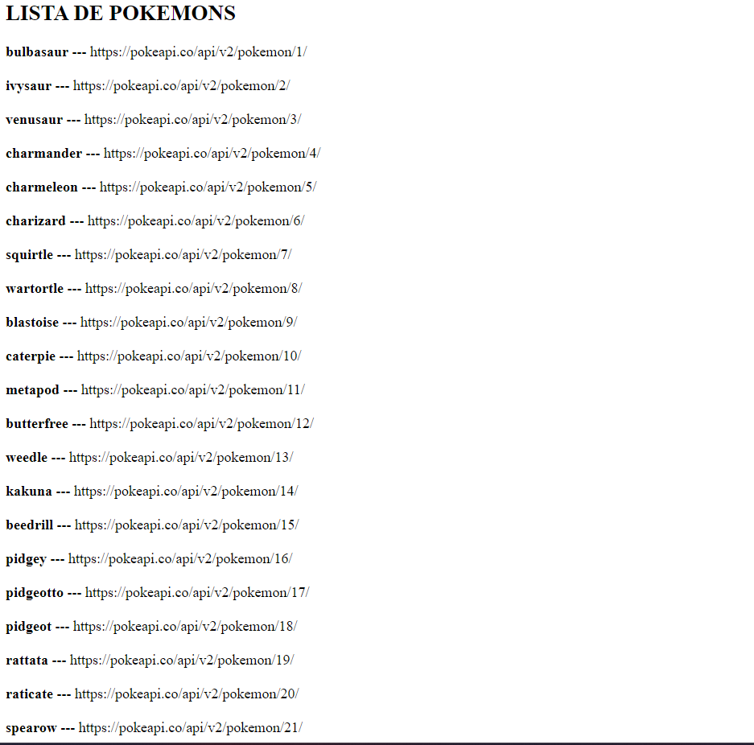

# Ejercicio
Sabiendo que la siguiente url *https://pokeapi.co/api/v2/pokemon?limit=151*, devuelve un array con el nombre de los Pokemons y la url que contiene toda la información de cada uno: 

1 . Estructura la información que te llega para mostrarla por pantalla como muestra la siguiente imagen:

## SOLUCIÓN:

[FICHERO JS](./sol_pokemons/script.js)

[FICHERO HTML](./sol_pokemons/index.html)
