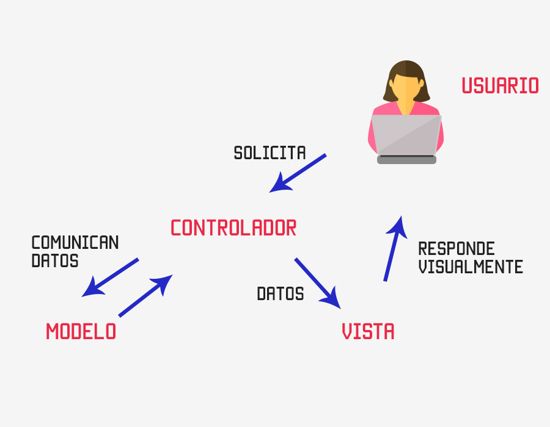

## MODELO-VISTA-CONTROLADOR

Es un patrón de arquitectura que proporciona una forma estructurada de organizar el código y separar las preocupaciones relacionadas con la lógica, la presentación de datos y la interacción del usuario. Es decir, separa los datos de una aplicación (modelo), la interfaz de usuario (vista) y la lógica (controlador).

La principal ventaja es la separación  de responsabilidades y la modularidad que proporciona.

Facilita el desarrollo y el mantenimiento del software, ya que cada componente puede ser desarrollado, probado y modificado de forma independiente sin afectar a los demás.

También permite la reutilización de componentes. Por ejemplo, es posible tener varias vistas que muestren los mismos datos del modelo de diferentes maneras, o tener varios controladores que actúen sobre el mismo modelo pero con lógicas de interacción diferentes.

### Modelo (Model)
Es la capa de los datos, donde se trabaja con los datos y la base de datos. Donde se realizarán todas las funciones relacionadas con las acciones sobre los datos: inserción, modificación y elemiminación.

### Vista (View)
Es la capa de la interfaz de usuario, las vistas.  Se encarga de mostrar los datos al usuario y de presentar la información de manera visualmente atractiva. Esta no realiza ninguna manipulación directa de los datos.

### Controlador (Controller)
Es el código donde se realizan las funciones para las acciones de la aplicación. Es el puente entre las vistas y los modelos. Recibe las interacciones del usuario a través de la interfaz de usuario y las procesa. Luego, actualiza el modelo según sea necesario y notifica a la vista para que se actualice y muestre los cambios correspondientes.

Por ejemplo, en una aplicación web, el modelo podría ser una capa de acceso a datos que se encarga de interactuar con la base de datos y realizar operaciones de CRUD (crear, leer, actualizar, eliminar). La vista sería la interfaz de usuario que muestra los datos y permite al usuario interactuar con ellos. El controlador sería responsable de recibir las solicitudes del usuario, procesar la lógica de negocio y actualizar tanto el modelo como la vista en consecuencia.

